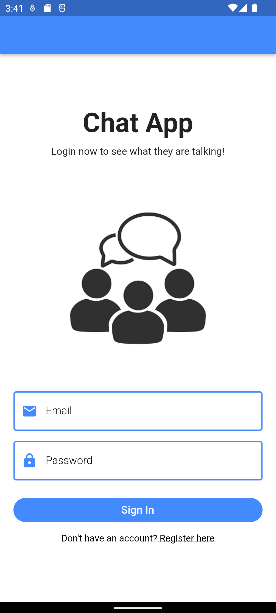

# chat_app

Chat app using Firebase

## Getting Started

## SETTING IT UP
1. Add firebase to this project and do check the google-services.json and GoogleServices-Info.plist file
2. Now run the app

## Screen Shots

This project is a starting point for a Flutter application.

For help getting started with Flutter development, view the
[online documentation](https://docs.flutter.dev/), which offers tutorials,
samples, guidance on mobile development, and a full API reference.
